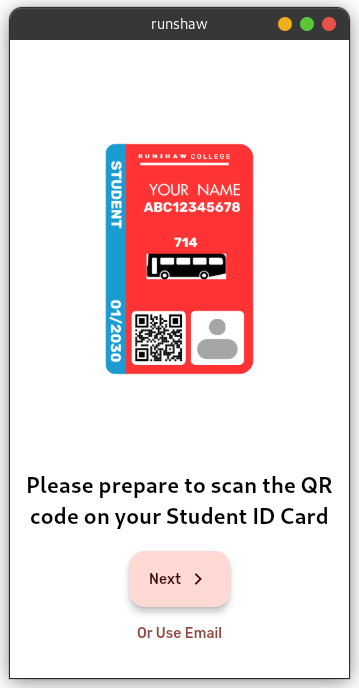
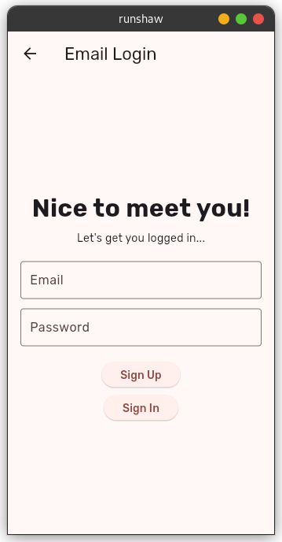
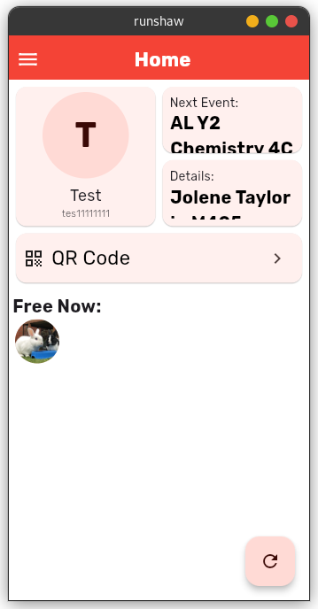
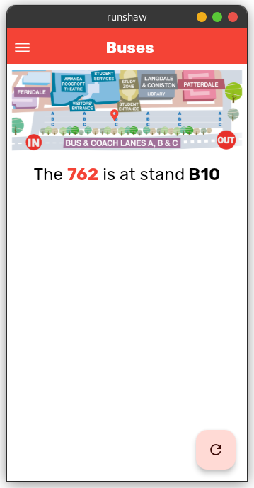
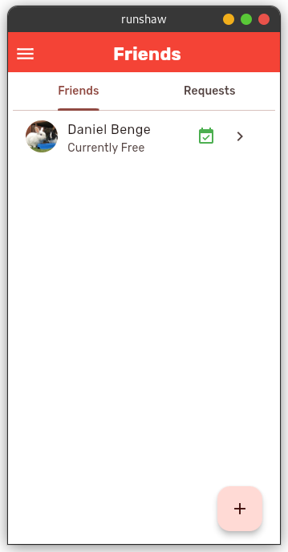
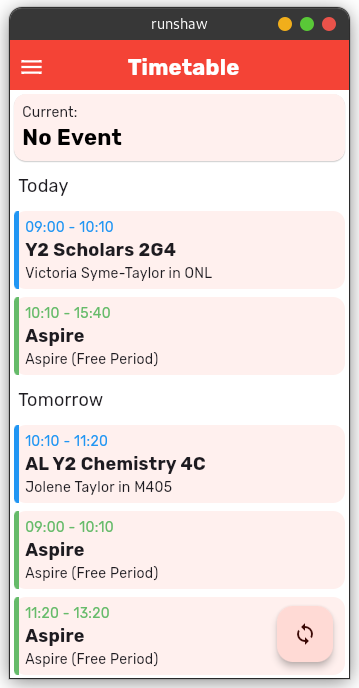
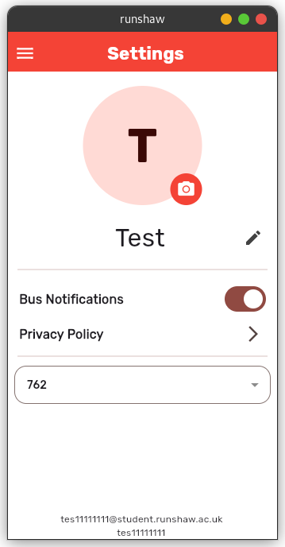

# "My Runshaw" App

This is a Flutter app for me and my friends to use in college. It allows us to share our timetables with each other and see who is free, and it also provides bus push notifications and calculates bus bay locations. 

## Development Explanation

I have written a post [on my website](https://danieldb.uk/posts/runshaw-app/) if you're interested in learning how I created this app.

## Screenshots

