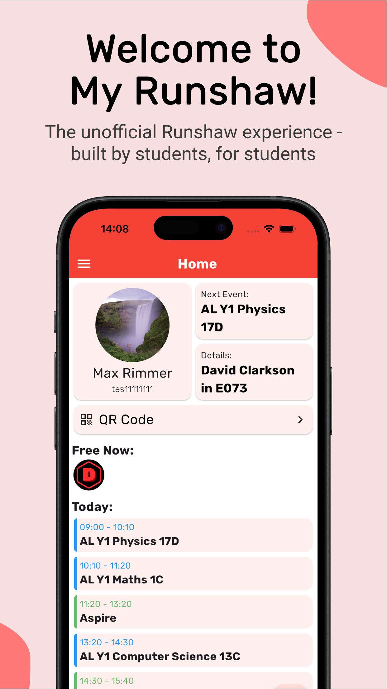
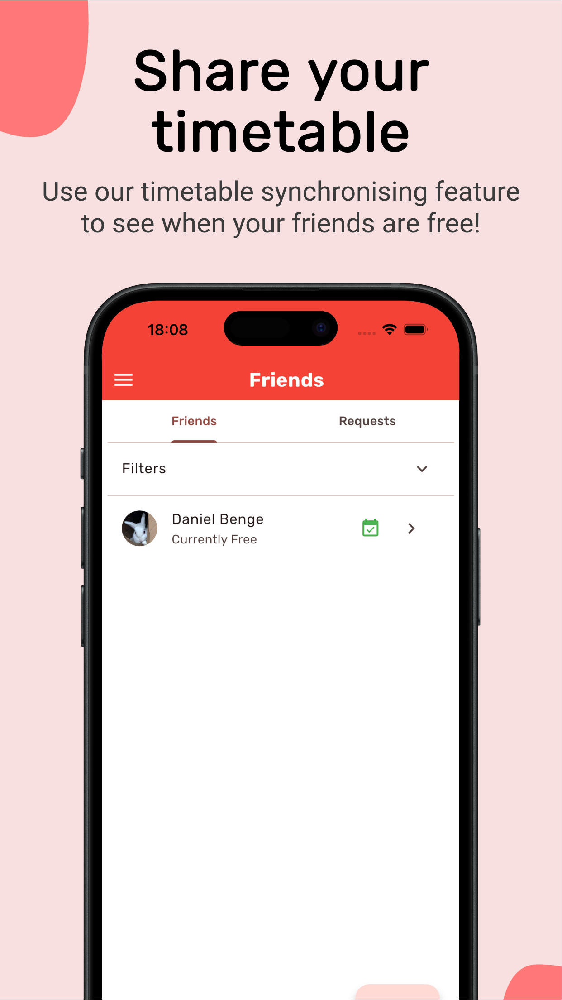
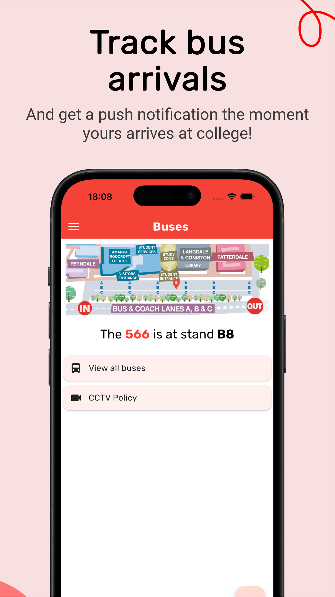
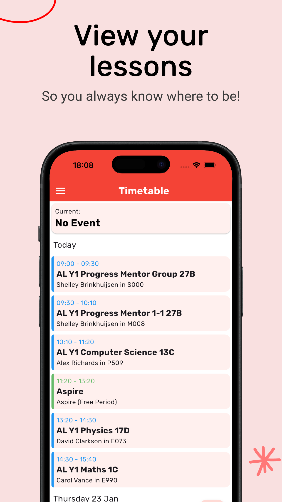

# "My Runshaw" App

| Android | iOS |
|:-:|:-:|
|  |  |

This is a Flutter app for me and my friends to use in college. It allows us to share our timetables with each other and see who is free, it provides bus push notifications and calculates bus bay locations, and it shows a map of the college and its layout. Backend source is available in a [separate repository](https://github.com/Dragon863/runshaw-friends-api). After this gained thousands of users in a few months, building this app has taught me a lot about scaling projects and maintaining production applications.

## Development

I have written a post [on my website](https://danieldb.uk/posts/runshaw-app/) if you're interested in learning how I created this app.
The key components include:
- Flutter frontend
- FastAPI backend
- Postgres database
- Appwrite auth
- Aptabase analytics
- Docker based deployments

## Screenshots
| | |
|-|-|
| | |
| ||

## Disclaimer

> This application is not affiliated with nor is it endorsed by any educational institution. Its development is solely maintained by a student, and the developer is not liable for any damages connected with the use of this application.