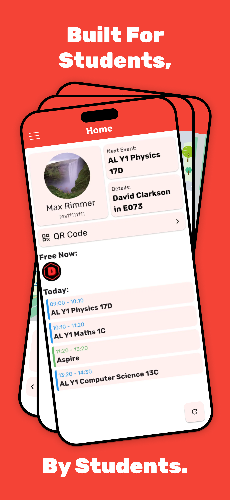
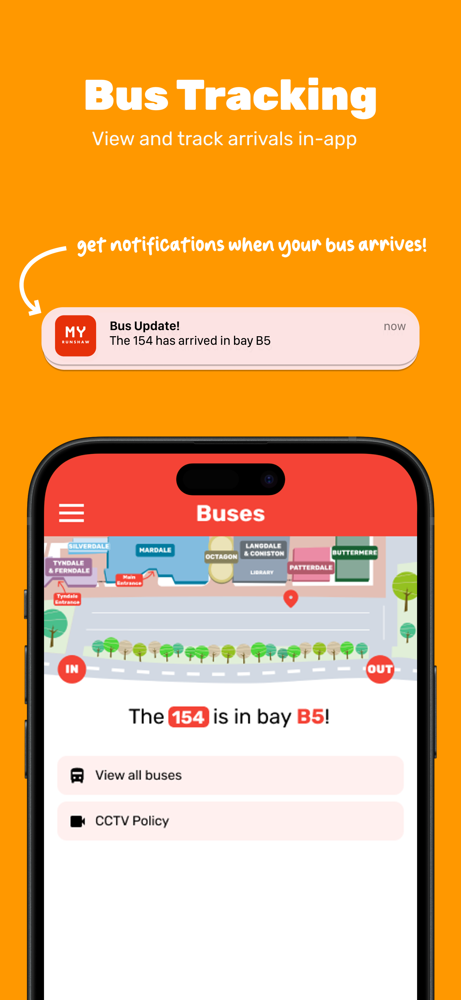
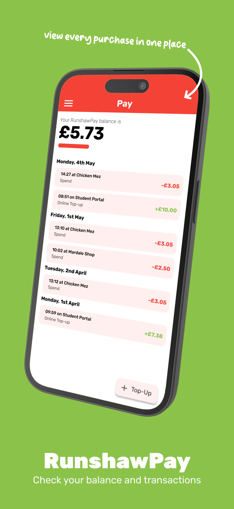
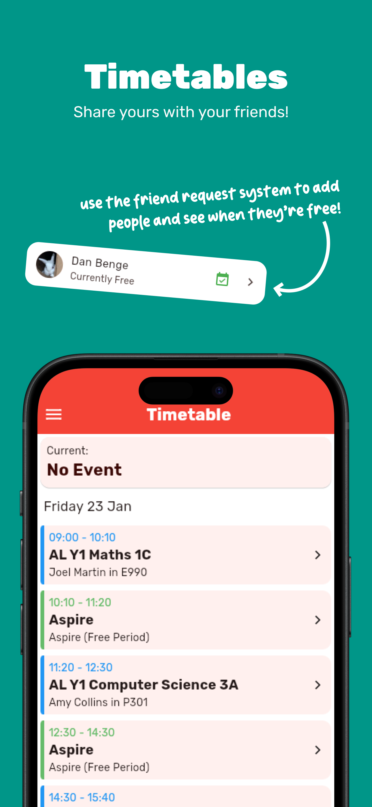
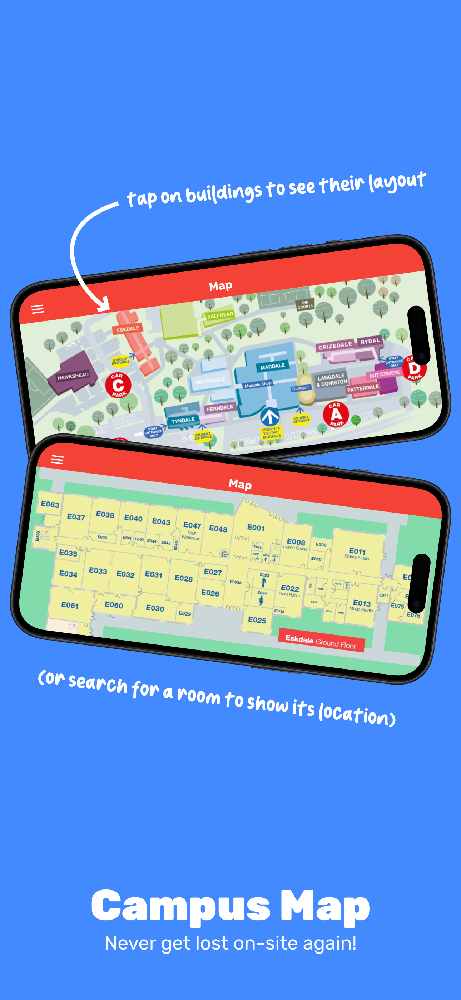

# "My Runshaw" App

| Android | iOS |
|:-:|:-:|
|  |  |

This is an unofficial app allowing students to share timetables with each other to see who is free, it provides bus push notifications and calculates bus bay locations, and it shows a map of the college and its layout. Backend source is available in a [separate repository](https://github.com/Dragon863/MyRunshawApi). After this gained thousands of users in a few months, building this app has taught me a lot about scaling projects and maintaining production applications.

## Installation

You can use the App Store or Google Play Store links at the top of this page to install the app on your device.
To run your own instance:
1. Follow the instructions in the [backend repository](https://github.com/Dragon863/MyRunshawApi) to set up the backend and database
3. Clone this repository and configure lib/utils/config.dart
4. Run the app using `flutter run`, or build it for release using `flutter build apk` or `flutter build ios`

## Development

I have written a post [on my website](https://danieldb.uk/posts/runshaw-app/) if you're interested in learning how I created this app.
The key components include:
- Flutter frontend
- ~~FastAPI backend~~ Migrated to ASP.NET Core backend
- Postgres database
- ~~Appwrite auth~~ Migrated to Entra OAuth2
- ~~Aptabase analytics~~ Now migrated to Posthog
- Docker image based deployments
- OneSignal push notifications

## Screenshots

| | |
|-|-|
| | |
| ||
| | |

## Disclaimer

> This application is not affiliated with nor is it endorsed by any educational institution. Its development is solely maintained by a student, and the developer is not liable for any damages connected with the use of this application.